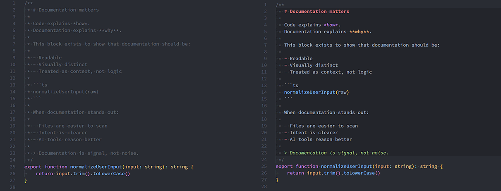

# JSDoc Markdown Plus

Documentation matters.

Not just as an afterthought, not buried in separate files that nobody opens, and not faded away by themes that make comments barely visible. Especially now, when humans and AI agents alike rely on code context to understand _why_ something exists before diving into _how_ it works.

**JSDoc Markdown Plus** exists to give documentation the relevance it deserves — directly inside your code.

It highlights Markdown syntax **only inside JSDoc comments** (`/** ... */`), and optionally places them on a subtle background, making documentation clearly readable, visually distinct, and intentionally separate from executable code.



## What this extension does

Inside JSDoc block comments, Markdown syntax is highlighted using VS Code’s built-in Markdown grammar.

This includes:

- Inline code: `` `code` ``
- Fenced code blocks:
    ````markdown
    ```ts
    const x: string = 'hello'
    ```
    ````
- Emphasis: `*italic*`, `**bold**`
- Headings, lists, and links

Outside of JSDoc blocks, **nothing changes**.

- `/* ... */` normal block comments are untouched
- `// ...` line comments are untouched

## What it does not do

- It does not modify normal comments
- It does not change code highlighting
- It does not add a new Markdown renderer
- It does not parse or validate JSDoc syntax

This extension is intentionally minimal and focused.

## Why a background?

Documentation is not code — and it shouldn’t visually compete with it.

The optional background makes JSDoc blocks:

- Easy to spot while scanning a file
- Clearly separated from logic
- Instantly recognizable as “documentation, not implementation”

This is especially helpful when:

- Onboarding to a new codebase
- Reviewing unfamiliar logic
- Working with AI agents that benefit from high-level explanations

## Supported languages

- JavaScript (`.js`, `.mjs`, `.cjs`)
- TypeScript (`.ts`)
- JavaScript React (`.jsx`)
- TypeScript React (`.tsx`)

## Configuration

### Background styling (optional)

You can enable or customize the background color used for JSDoc blocks:

```json
{
	"jsdocMarkdownPlus.backgroundColor": "rgba(0, 0, 0, 0.1)"
}
```

Notes:

- Set `backgroundColor` to `null` or `""` to disable the background entirely
- The background applies to the full `/** ... */` range

## Customizing text colors and style

This extension intentionally does **not** override your theme’s Markdown colors.

Instead, styling is controlled via standard VS Code token customization so that:

- Markdown elements (code, headings, links, etc.) keep their existing theme colors
- You can remove italics or tweak colors without breaking syntax highlighting

### Available scopes

- `meta.jsdocMarkdownPlus`  
  Base scope for JSDoc Markdown text
- `punctuation.definition.comment.jsdocMarkdownPlus.leading`  
  Leading `*` characters in multi-line JSDoc blocks

### Example customization

```json
{
	"editor.tokenColorCustomizations": {
		"textMateRules": [
			{
				"scope": "meta.jsdocMarkdownPlus",
				"settings": {
					"foreground": "#AABBCC",
					"fontStyle": ""
				}
			},
			{
				"scope": "punctuation.definition.comment.jsdocMarkdownPlus.leading",
				"settings": {
					"foreground": "#6A737D"
				}
			}
		]
	}
}
```

Notes:

- Set `fontStyle` to `""` to remove italics
- More specific Markdown scopes (inline code, headings, bold, links, etc.) still take precedence
